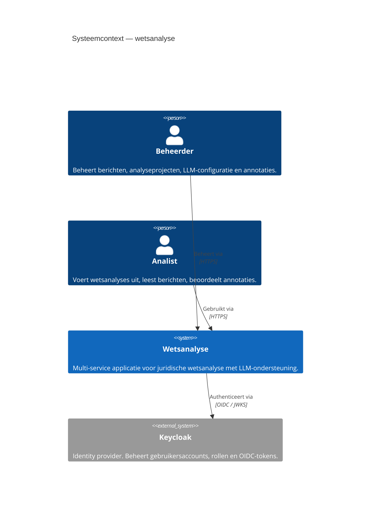
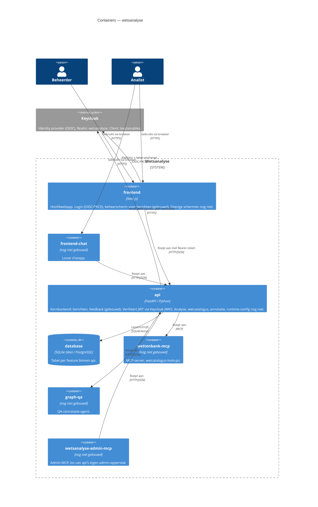
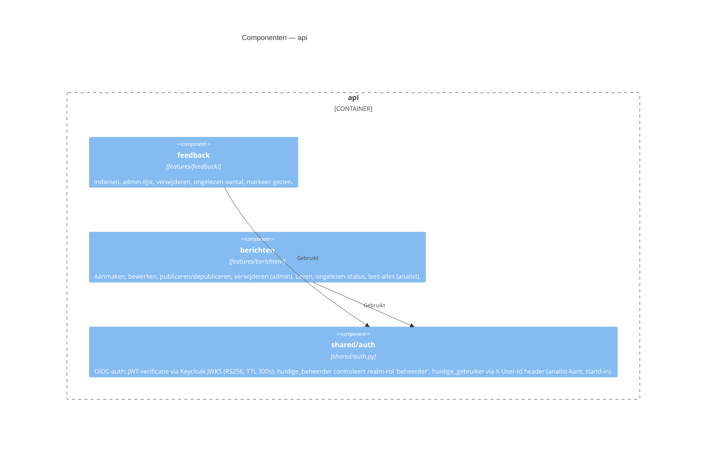
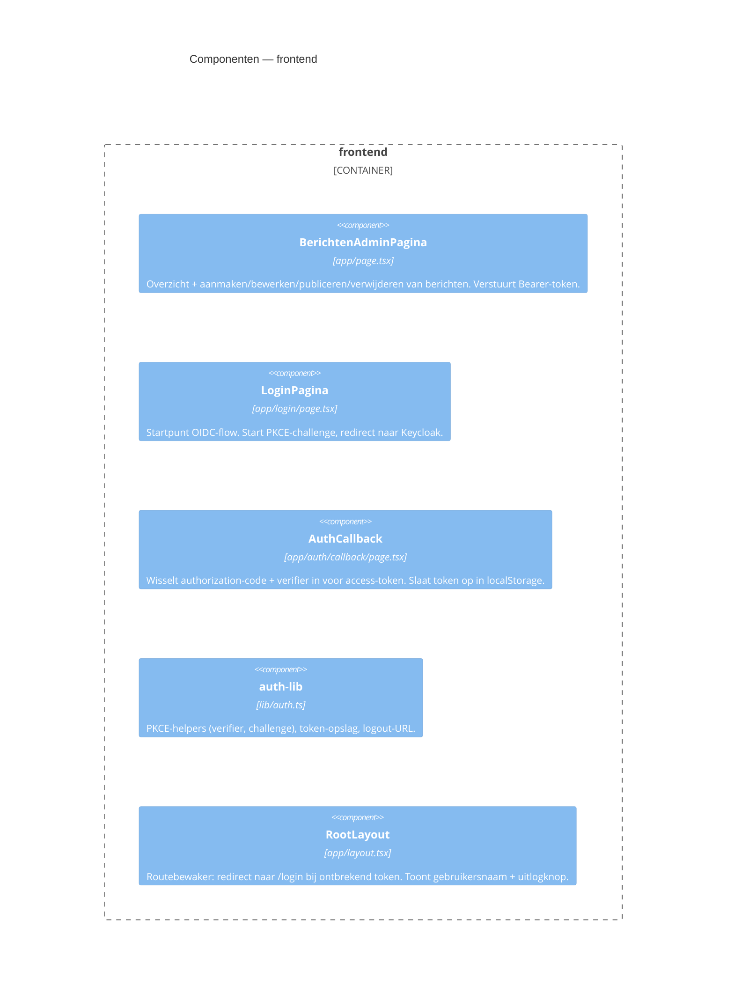

# C4-model — wetsanalyse

Drie niveaus: Context (wie gebruikt het systeem en wat zijn de externe grenzen),
Container (welke services zijn er en hoe praten ze), Component (welke features zitten
binnen elke service). Code (L4) wordt niet bijgehouden — dat staat in de code zelf.

Zie §Bijhouden voor wanneer elk niveau bijgewerkt moet worden.

---

## L1 — Context

Twee gebruikersrollen, één systeem, Keycloak als externe authenticatieservice.

---

## L2 — Container

Zes services (ADR-0001). Gebouwd: `api` en `frontend`. De overige vier zijn vastgelegd
in de topologie maar nog niet geïmplementeerd — ze staan hier al om het volledige plaatje
te tonen; markeer ze als gebouwd zodra de eerste code er is.

---

## L3 — Component

Alleen voor gebouwde containers. Voeg een component toe zodra een nieuwe feature-map
(`api/app/features/<naam>/`) of een nieuw scherm (`frontend/app/<naam>/`) wordt aangemaakt.

### `api`

### `frontend`

---

## Bijhouden

| Niveau | Bijwerken wanneer |
|---|---|
| L1 Context | Een nieuw gebruikerstype of een externe service (buiten de systeemgrens) wordt toegevoegd of verwijderd. |
| L2 Container | Een nieuwe service wordt aangemaakt of de eerste code van een geplande service wordt gebouwd; een service wordt verwijderd of samengevoegd. |
| L3 Component | Een nieuwe `api/app/features/<naam>/`-map of een nieuw scherm in `frontend/app/` wordt toegevoegd; een component wordt verwijderd of hernoemd. |
| L4 Code | Niet bijgehouden — staat in de code zelf. |
